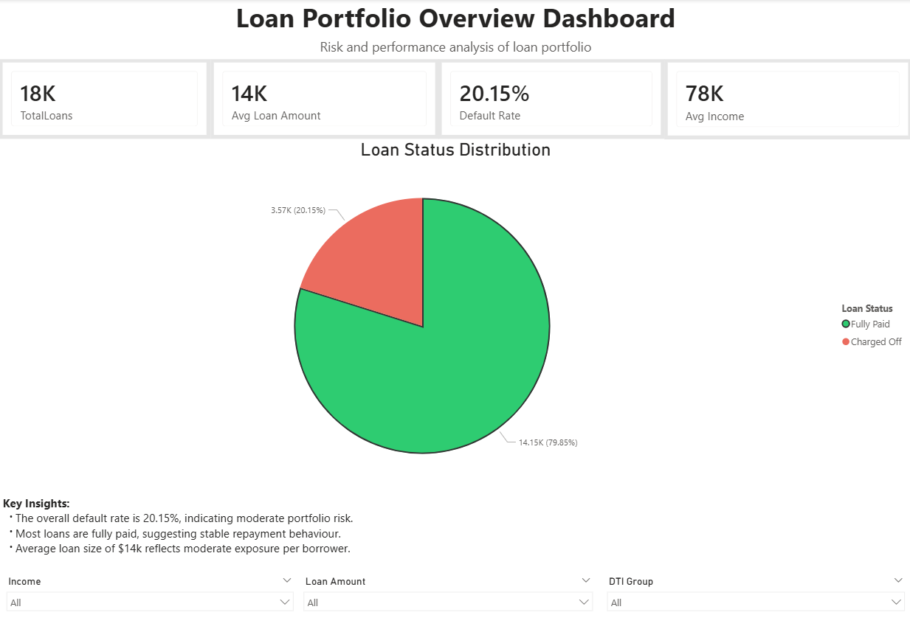
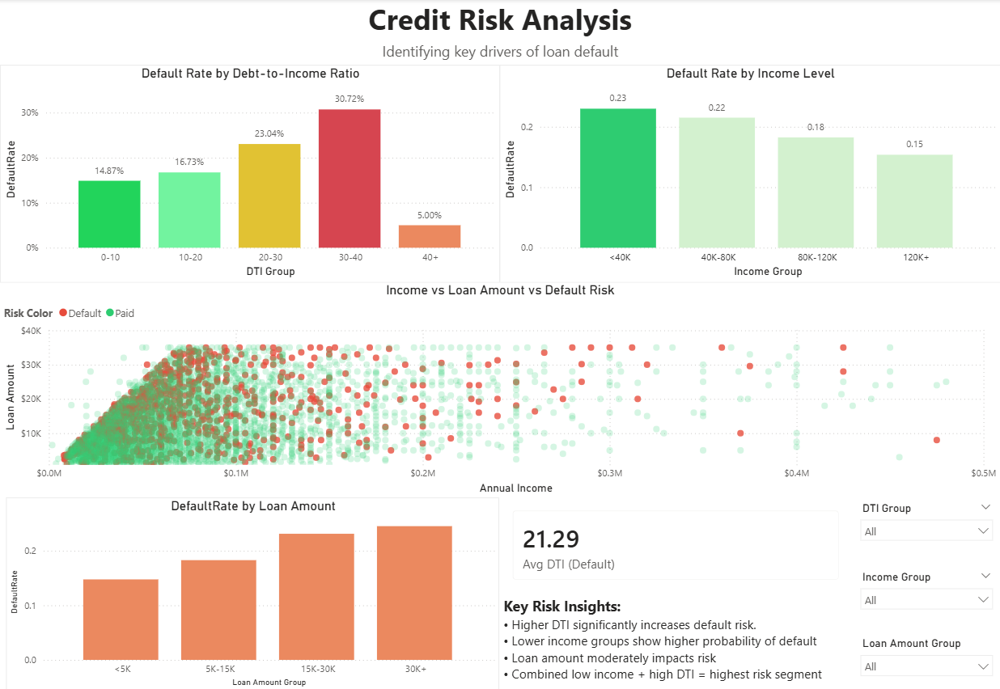
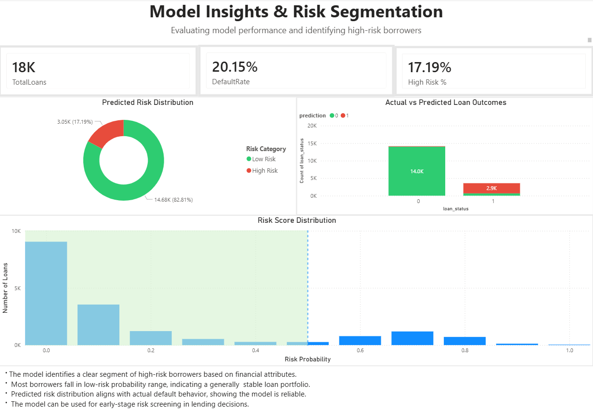

# Loan_Default_Risk_Analysis
Loan default prediction and credit risk dashboard using Python and Power BI

## Overview 
This project simulates a real-world credit risk analytics workflow by combining data analysis, predictive modelling, and business intelligence reporting to support data-driven lending decisions.

The objective is to identify high-risk borrowers, understand key drivers of loan default, and provide actionable insights to improve portfolio performance.

## Business Problem
Financial institutions face significant losses due to borrower defaults. Early identification of high-risk applicants is critical to:
- Reduce default rates
- Improve loan portfolio quality
- Enable risk-based lending decisions

This project answers:
_Which borrowers are most likely to default, and how can we identify them effectively?_

## Dataset
- Source: Lending dataset (Kaggle)
- Sample size: ~20,000 records (optimised for performance)
- Key Features:
    - Loan Amount
    - Interest Rate
    - Annual Income
    - Debt-to-Income Ratio (DTI)
    - Loan Status (Fully Paid / Charged Off)
 
## Tools and Technologies
- **Python:** Data cleaning. feature engineering, modeling
- **Libraries:** Pandas, Matplotlib, Scikit-learn
- **PowerBI:** Interactive dashboard development
- **Jupiter Notebook:** Analysis workflow

## Project Overview
### 1. **Data Cleaning & Preparation**
- Standardised column formats and handled missing values
- Cleaned and validated financial attributes
- Converted loan status into binary variables for modelling
  
### 2. **Exploratory Data Analysis**
- Analysed the distribution of borrower income and loan amounts to understand portfolio composition
- Examined the relationship between DTI and default risk to identify financially over-leveraged borrowers
- Evaluated income vs loan amount patterns to assess repayment capacity
- Compared default rates across income groups, DTI levels, and loan segments
- Identified high-risk borrower profiles using multi-variable analysis

   
### 3. **Feature Engineering**
- Created **loan-to-income** ratio to capture repayment capacity
- Grouped borrowers into risk-relevant segments

### 4. **Predictive Modelling**
- Built a **Random Forest classifier** to identify high-risk borrowers
- Evaluated performance using classification metrics 
 #### **Model Performance**
  - Accuracy: **78%**
  - Precision (Default Class): **45%**
  - Recall (Default Class): **15%**

**Interpretation:**
The model performs well in identifying non-default cases but has limited ability to detect actual defaulters.
This highlights the challenges of class imbalance in credit risk modelling. 

### 5. **Dashboard Development (Power BI)**

   #### **Page 1: Loan Portfolio Overview**
   
   _Provides a high-level view of portfolio health for quick decision-making._
    
   - Displays key KPIs: Total Loans, Avg Loan Amount, Default Rate, Avg Income
   - Provides Loan status distribution and portfolio composition
   - Interactive slicers for filtering (Income, Loan Amount, DTI Group)

   **Key Insight:**
   
   The portfolio shows a **~20% default rate**, indicating moderate risk with overall stable repayment behaviour.

   #### **Page 2: Credit Risk Analysis**

 _Helps identify risk drivers and vulnerable customer segments._
   
   - Default rate by DTI, income level, and loan amount
   - Multi-variable risk visualisation

   **Key Insight:**
   
   - Borrowers with **DTI > 35%** exhibit significantly higher default risk
   - **Lower-income groups** are more prone to default
   - Combined **low income + high DTI** represents the highest risk segment

  #### **Page 3: Model Insights and Risk Segmentation**

 _Supports risk-based lending and early-stage screening_
  
  - Predicted risk distribution
  - Actual vs predicted loan outcomes
  - Risk score segmentation

 **Key Insights:**
- Model effectively identifies high-risk borrower segments
- Predicted risk aligns closely with actual default behaviour
- Enables **early-stage credit risk screening**

## Key Outcomes
- Identified key financial drivers of loan default (DTI, income, loan-to-income ratio)
- Built a predictive model to classify high-risk borrowers
- Developed a 3-page interactive dashboard for portfolio monitoring
- Demonstrated how analytics can support **risk-based lending decisions**

## Business Impact
- Improves identification of high-risk applicants
- Enables proactive risk mitigation strategies
- Enhances visibility into loan portfolio performance
- Supports data-driven decision-making in financial services
 
## Project Structure
```
Loan-Default-Risk-Analysis/
│
├── data/
├── notebook.ipynb
├── loan_analysis_output.csv
├── dashboard.pbix
├── images/
└── README.md
```

## How to Run
1. Clone this repository
2. Install dependencies
   ```
   pip install pandas numpy scikit-learn matplotlib seaborn
   ```
3. Run the Jupyter Notebook
   ```
   notebook.ipynb
   ```
4. Open the Power BI file
   ```
   dashboard.pbix
   ```

## Assumptions and Limitations
- The dataset does not include a credit score or a detailed payment history
- Model trained on a sample dataset (~20K records)
- Performance may vary with real-world production data

## Future Improvements
- Incorporate additional financial variables (credit score, payment behaviour)
- Use advanced models for improved performance
- Deploy model for real-time risk scoring
- Integrate dashboard with live data sources

## Dashboard Preview

### Portfolio Overview



### Credit Risk Analysis



### Model Insights

   


  
